# Programmation linéaire, recherche opérationnelle et algorithmique 

**Objectif:** maitriser les fondements de la programmation fonctionnelle en Python, de la programmation défensive, de la programmation orientée objet, de l'algorithmique, de la programmation linéaire et aborder la programmation linéaire mixte.

[Cas de figure](#cas-de-figure-avec-pulp) en programmation linéaire avec PuLP à la toute fin.

1. Programmation fonctionnelle et plus: employer les fonctions, les décorateurs pour modifier temporairement une fonction avec une autre fonction; déployer des environnements virtuels, élaborer des fichiers de déploiement requirements.txt

|    |
|:---|
| 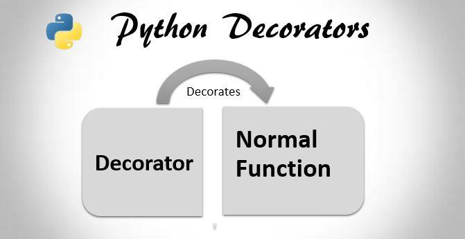 |

2. Programmation défensive et plus: employer les conventions et les bonnes pratiques avec les PEP et `pylint`; gérer les erreurs, les exceptions; aborder des patrons de conception, le débogueur Pdb, le typage et Mypy

|   |   |   |
|:---|:---|:---|
| 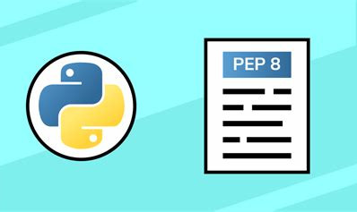 | 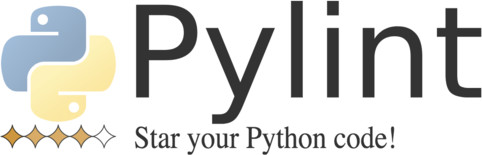  |   |

3. Programmation orientée objet et plus: employer les classes, les classes abstraites, l'héritage, les itérateurs, la surcharge pour redéfinir une méthode dans une sous-classe ou faire du polymorphisme sur différents types, les constructeurs, les instances, les attributs et méthodes de classe, les attributs et méthodes d'instance, les variables et constantes de classe et d'instance; documenter le code source avec les *docstring*; gérer des paquets de fichiers

|   |   |   |
|:---|:---|:---|
|  | 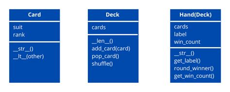  | 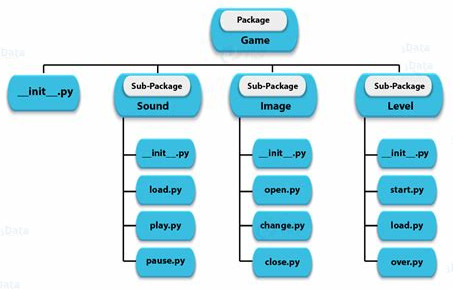  |

4. Algorithmique et structures linéaires: employer des notions tirées d'*Artificial Intelligence, A Modern Approach*, par Stuart Russell et Peter Norvig; employer A* en Python 2.7 format portable; aborder la programmation dynamique et la récursivité, les structures linéaires comme une pile (*stack*), une file (*queue*)

|   |   |   |
|:---|:---|:---|
| 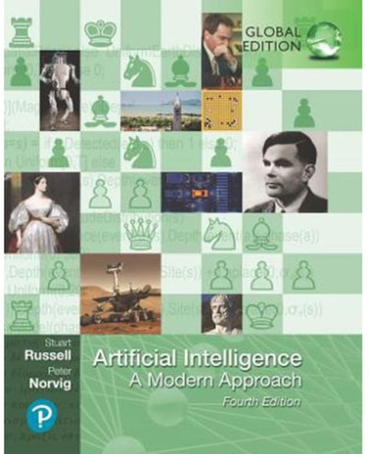 | 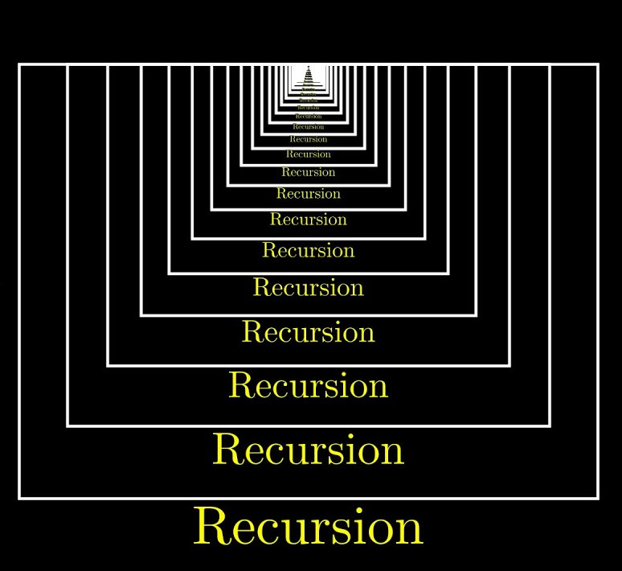 | 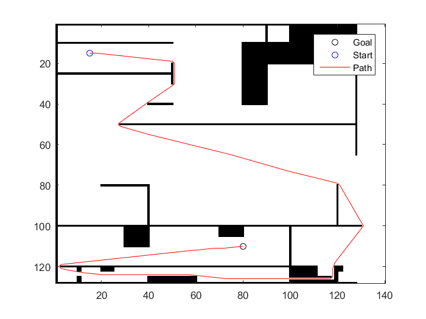  |
|    | 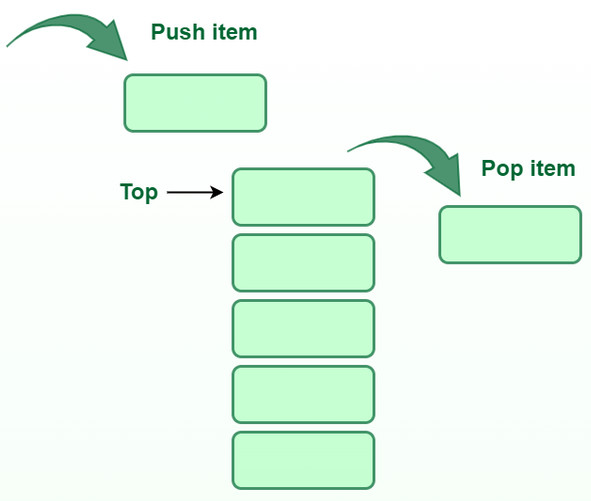  | 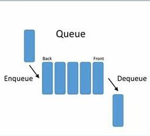  |
|    | 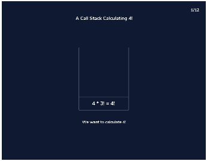  | 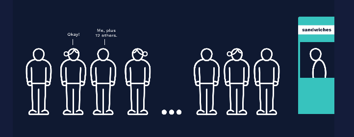  |

5. Programmation linéaire et plus: utiliser PuLP pour solutionner des problèmes de planification, de production, de transport, pour maximiser les profits ou minimiser les coûts, déterminer les variables décisionnelles, les fonctions objectives avec différents types de frontières, les contraintes, utiliser différents algorithmes de solution, visualiser les zones de faisabilité; travailler avec des listes, des dictionnaires ou des DataFrames Pandas; aborder les lgorithmes gloutons, solutionner des problèmes classiques comme celui du sac à dos (*knapsack problem*) avec différentes approches pour changer résultats, aborder la programmation mixte avec Python-MIP

## Cas de figure en programmation linéaire avec PuLP

1. PuLP: faisabilité
2. PuLP: sac à dos

|   |   |   |
|:---|:---|:---|
| 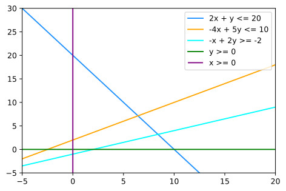 | 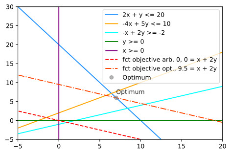  | 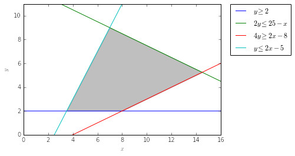  |
| 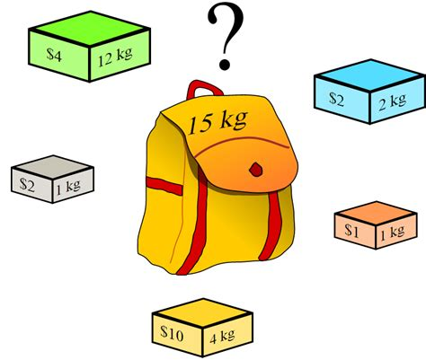  |   |   |
